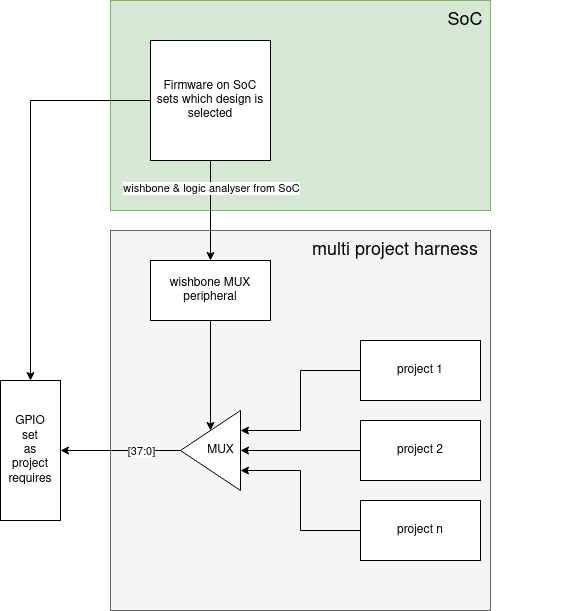

# Multi Project Harness - mpw-one-b

* This is a proposal for handling multiple projects in the user project area of the [Caravel harness](https://github.com/efabless/caravel)
* This is a fork of caravel with https://github.com/mattvenn/multi-project-harness/tree/separate-macro added to /verilog/rtl/
* user_project_wrapper is then adjusted to instantiate all the submodules.

# Important!

* If you want to actually build the wrapper, you need to checkout the release branch.
* This branch is just used to rebuild caravel.gds with 'make ship'

# Tests

* Full system tests for each sub project: verilog/dv/caravel/user_proj_example
* Separate projects: run make sim in root directory of multi_project_harness: https://github.com/mattvenn/multi-project-harness/blob/separate-macro/test_harness.py

# OpenLane Configs

All the OpenLane configs for each project are here: https://github.com/mattvenn/multi-project-harness/tree/separate-macro/openlane

The multi project harness turned out to be more of a MUX, and was hardened separately. Make sure you are on the 'separate-macro' branch of the repo.

# Submodules

## seven-segment-seconds

description: shows seconds on a seven segment LED display.

author: Matt Venn

url: https://github.com/mattvenn/seven-segment-seconds

## ws2812

description: ws2812 LED interface for 8 addressable LEDs

author: Matt Venn

url: https://github.com/mattvenn/ws2812-core.git

## vga-clock

description: show the time on a VGA panel

author: Matt Venn

url: https://github.com/mattvenn/vga-clock.git

## spinet

description: multi node computer controller

author: Richard Miller

url: https://github.com/millerresearch/spinet

## asicfreq

description: Frequency counter

author: Michael Betz & Vamsi Vytla

url: https://git.sr.ht/~jersey99/asicfreq

## ASIC_watch

description: 4 digit 7 segment clock

author: Guillem Cabo

url: https://github.com/GuillemCabo/ASIC_watch.git

## TPM2137

description: Reverse Engineering challenge

author: Q3K

url: https://github.com/mattvenn/TPM2137

## mm2hdmi

description: HDMI driver

author: Aleksandar Pajkanovic

url: https://github.com/nanoluka/mm2hdmi.git
